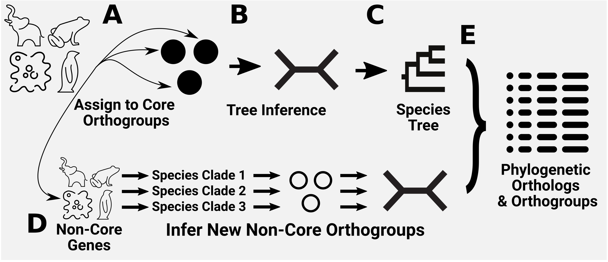
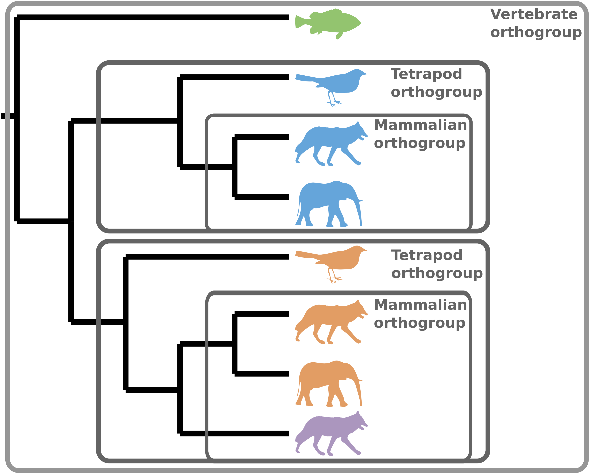
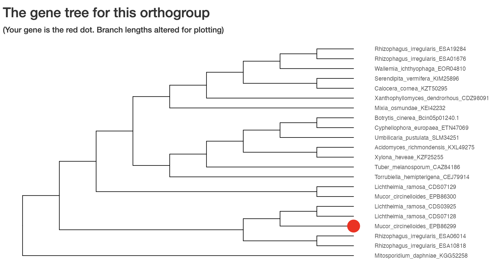

# OrthoFinder3


OrthoFinder identifies orthogroups, infers gene trees for all orthogroups, and analyzes these gene trees to identify the rooted species tree. The method subsequently identifies all gene duplication events in the complete set of gene trees, and analyzes this information in the context of the species tree to provide both gene tree and species tree-level analysis of gene duplication events. OrthoFinder further analyzes all of this phylogenetic information to identify the complete set of orthologs between all species and provide extensive comparative genomics statistics.

## Table of contents
- [Installation](#Installation)
- [Simple Usage](#Simple-Usage)
- [Advanced Usage](#Advanced-Usage)
- [Command line Options](#Command-line-Options)
- [Output files](#Output-files)
- [What's New?](#What-is-new)
- [Citation](#Citation)

Tutorials and further documentation can be found on our [github.io](https://davidemms.github.io/)

A single PDF with all documentation, tutorials, and this README is available [here](http://www.iqtree.org/doc/iqtree-doc.pdf)

## Installation

The easiest way to install OrthoFinder3 is using [conda](https://www.machinelearningplus.com/deployment/conda-create-environment-and-everything-you-need-to-know-to-manage-conda-virtual-environment/).
```bash
conda install orthofinder
orthofinder -h
```

If you are on a mac that has an M1/M2/M3 chip, you might have to adjust your conda architecture. Instructions can be found [here](https://towardsdatascience.com/how-to-manage-conda-environments-on-an-apple-silicon-m1-mac-1e29cb3bad12).

Alternatively, you can also download OrthoFinder3 directly from github
```bash
git clone https://github.com/ortho.git
python OrthoFinder/orthofinder -h
```

A docker image is also available [here](https://www.linkedin.com/in/jonathan-holmes-ab2794294/?originalSubdomain=uk)

**Installing dependencies**

some info on how to do manually install dependencies if you want


## Simple Usage

OrthoFinder3 requires one fasta file for each species, containing the amino acid sequences for each gene.

Ideally you want to use a single transcript variant per gene.
We provide a script `primary_transcripts.py` to extract the longest variant per gene;

```bash
for f in *fa ; do python primary_transcript.py $f ; done
```

Run OrthoFinder2 on FASTA format proteomes in `<dir>`

```python
orthofinder [options] -f <dir> -M dendroblast
```


## Advanced Usage

OrthoFinder3 provides a new workflow to assign new genes from new species to an already inferred set of orthogroups for a smaller, core group of species. 



We provide a script ``core_maker.py`` to automatically pick a good set of phylogenetically diverse core proteomes from a directory. For more details on how our method works, see [here](https://www.linkedin.com/in/jonathan-holmes-ab2794294/?originalSubdomain=uk)

```python
python core_maker.py -f <dir1> -o <prefix>
```

This script will output a folder `<prefix>_core` with the core proteomes, and a folder `<prefix>_additional`  with the additional proteomes

You can then run OrthoFinder3 on the core proteomes

```python
orthofinder [options] -f <dir_core>
```

... and then add the additional proteomes

```python
orthofinder [options] --assign <dir_additional> --core <dir_core>
```

**Note that this workflow requires multiple sequence alignment, so you can't add to OrthoFinder2 results that were run with the default `-M dendroblast`**

(Maybe some more commands for things that people commonly want to do?)


## Command-line options

Command-line options for OrthoFinder3

**Adding additional species**
| Parameter | Description                               |
|-----------|-------------------------------------------|
| `--assign <dir1> --core <dir2>`      | Assign species from `<dir1>` to existing orthogroups in `<dir2>`.                   |

**Method choices**
| Parameter | Description                               | Default   | Options                                                                                     |
|-----------|-------------------------------------------|-----------|---------------------------------------------------------------------------------------------|
| `-M`      | Method for gene tree inference.           | `msa`     | `dendroblast`, `msa`                                                                        |
| `-S`      | Sequence search program                   | `diamond` | `blast`, `diamond`, `diamond_ultra_sens`, `diamond_custom`, `diamond_ultra_sens_custom`, `blast_gz`, `mmseqs`, `blast_nucl` |
| `-A`      | MSA program, requires `-M msa`            | `mafft`   | `mafft`, `muscle`, `mafft_memsave`                                                          |
| `-T`      | Tree inference method, requires `-M msa`  | `fasttree`| `fasttree`, `fasttree_fastest`, `raxml`, `raxml-ng`, `iqtree`                               |
| `-I`      | MCL inflation parameter                   | `1.2`     | `1-10`                                                                                         |

**Input options**
| Parameter | Description                               |
|-----------|-------------------------------------------|
| `-d`      | Input is DNA sequences.                   |
| `-s`      | User-specified rooted species tree.        |

**Output options**
| Parameter   | Description                                                                 |
|-----------  |-----------------------------------------------------------------------------|
| `-x <file>`      | Info for outputting results in OrthoXML format.                             |
| `-p <dir>`      | Write the temporary pickle files to `<dir>`.                                |
| `-X`      | Don’t add species names to sequence IDs.                                    |
| `-n <txt>`      | Name to append to the results directory.                                    |
| `-o <txt>`      | Specify a non-default results directory.                                    |
| `-efn`    | Extend the output directory name with the name of the scoring matrix, gap penalties, search program, MSA program, and tree program. |

**Parallel processing options**
| Parameter | Description                                 | Default |
|-----------|---------------------------------------------|---------|
| `-t`      | Number of parallel sequence search threads. | `11`    |
| `-a`      | Number of parallel analysis threads.        | `1`     |

**Workflow stopping options**
| Parameter | Description                                                                 |
|-----------|-----------------------------------------------------------------------------|
| `-op`     | Stop after preparing input files for BLAST.                                 |
| `-og`     | Stop after inferring orthogroups.                                           |
| `-os`     | Stop after writing sequence files for orthogroups (requires `-M msa`).      |
| `-oa`     | Stop after inferring alignments for orthogroups (requires `-M msa`).        |
| `-ot`     | Stop after inferring gene trees for orthogroups.                            |

**Workflow restart options**
| Parameter  | Description                                                  |
|------------|--------------------------------------------------------------|
| `-b <dir>` | Start OrthoFinder from pre-computed BLAST results in `<dir>`. |
| `-fg <dir>`| Start OrthoFinder from pre-computed orthogroups in `<dir>`.   |
| `-ft <dir>`| Start OrthoFinder from pre-computed gene trees in `<dir>`.    |

**Other options**
| Parameter        | Description                                                               |
|------------------|---------------------------------------------------------------------------|
| `-1`             | Only perform one-way sequence search.                                     |
| `--matrix`       | Scoring matrix allowed by DIAMOND.                                        |
| `--custom-matrix`| Custom scoring matrix.                                                    |
| `-z`             | Don’t trim MSAs (columns >= 90% gap, min. alignment length 500).          |
| `--save-space`   | Only create one compressed orthologs file per species.                    |
| `-y`             | Split paralogous clades below the root of a HOG into separate HOGs.        |
| `-h`             | Print this help text.                                                     |
| `-v`             | Print version.                                                     |


## Output files

A standard OrthoFinder run produces a set of files describing the orthogroups, orthologs, gene trees, resolve gene trees, the rooted species tree, gene duplication events and comparative genomic statistics for the set of species being analysed. These files are located in an intuitive directory structure.

Full details on the output files and directories can be found [here](https://uk.linkedin.com/in/jonathan-holmes-ab2794294). The directories that are useful for most users are;

```/Phylogenetic_Hierarchical_Orthogroups```
- Each file is a phylogenetic hierarchical orthogroup (HOG) for a different node of the species tree
- Each row of a file contain the genes belonging to a single orthogroup
- Each species is represented by a single column

```/Orthologues```
- Each species has a sub-directory that in turn contains a file for each pairwise species comparison, listing the orthologs between that species pair.

```/Comparative_Genomics_Statistics```
- Files containing summary statistics across all orthogroups, as well as comparisons between each pair of species

```/Resolved_Gene_Trees```
- A rooted phylogenetic tree inferred for each orthogroup with 4 or more sequences and resolved using the OrthoFinder hybrid species-overlap/duplication-loss coalescent model.

```/Species_Tree```
- SpeciesTree_rooted.txt = A STAG species tree inferred from all orthogroups, containing STAG support values at internal nodes and rooted using STRIDE.
- SpeciesTree_rooted_node_labels.txt = The same tree, but with nodes labels instead of support values (useful to map gene duplication events)

```/Gene_Duplication_Events```
- `Duplications.tsv` has a row for each duplication, with information on orthogroup, species, node, and support.
- `SpeciesTree_Gene_Duplications_0.5_Support.txt` provides a summation of the above duplications over the branches of the species tree.

```/Orthogroup_Sequences```
- A FASTA file for each orthogroup giving the amino acid sequences for each gene in the orthogroup.


## What is new?
OrthoFinder3 has several major changes comapred to OrthoFinder2

**New workflow for scalability**

OrthoFinder3 provides the ``--core --assign`` workflow to assign new genes from new species to an already inferred set of orthogroups for a smaller, core group of species. SHOOT is used to create profiles for core orthogroups, and new genes are assigned to these orthogroups without requiring a costly all-versus-all sequence search. Unassigned genes, in new species clades corresponding to orthogroups that arose more recently than the divergence of the core species are analysed on a clade-by-clade basis. The resulting gene trees are then analysed using the standard workflow to infer the same phylogenetically determined data as for the standard workflow.

**Phylogenetic Hierarchical Orthogroups**

OrthoFinder3 uses a phylogenetic approach of inferring rooted gene trees to determine orthologs. This is in contrast to methods that use only sequence similarity to infer orthogroups. We have now extended our phylogenetic analysis to orthogroups, by analysing gene trees to determine phylogenetic hierarchical orthogroups (HOGs) for for each clade within the species tree.

This approach significantly increases the accuracy of orthogroups, and allows users to include outgroups in their analysis whilst analysing orthogroups for only the clade of species you are interested in.

All output files now by default give information for the hierarchical orthogroup including all species (e.g. from the root of the species tree, node N0). However, we also provide orthogroups for every node of the species tree in `/Comparative_Genomics_Statistics` (e.g. `N3.tsv`).



**Performance improvements**

(4x quicker runtime, 2.5x lower RAM usage, 15% more accurate orthogroups)

**New Benchmarking**

We have also updated the bespoke artisan benchmarking script from [OrthoBench](https://github.com/davidemms/Open_Orthobench) to allow for better comparison between methods.

**Data Visualization**

We also provide an [R shiny](https://www.rstudio.com/products/shiny/) interactive app that users can use to extract information from OrthoFinder3 results. Users can enter a gene ID and get information on its orthologs and duplications, and view the gene tree


## Citation

The manuscript "OrthoFinder3 is the best" is now published in *Nature*
[link here](https://uk.linkedin.com/in/jonathan-holmes-ab2794294).

[Emms & Kelly (2015)](https://genomebiology.biomedcentral.com/articles/10.1186/s13059-015-0721-2]) introduced the orthogroup inference method.

[Emms & Kelly (2019)](https://genomebiology.biomedcentral.com/articles/10.1186/s13059-019-1832-y) introduced the phylogenetic inference of orthologs, including rooted gene and species trees, and gene duplication events.

[Emms & Kelly (2017)](https://www.ncbi.nlm.nih.gov/pmc/articles/PMC5850722/) introduced the STRIDE method to root an unrooted species tree.

[Emms & Kelly (2017)](https://www.biorxiv.org/content/10.1101/267914v1) introduced the STAG method of species tree inference.

## Meet the team

OrthoFinder was developed by David Emms & Steve Kelly

Current members of the OrthoFinder team:

OrthoYi, OrthoJohnnie, OrthoLaurie


