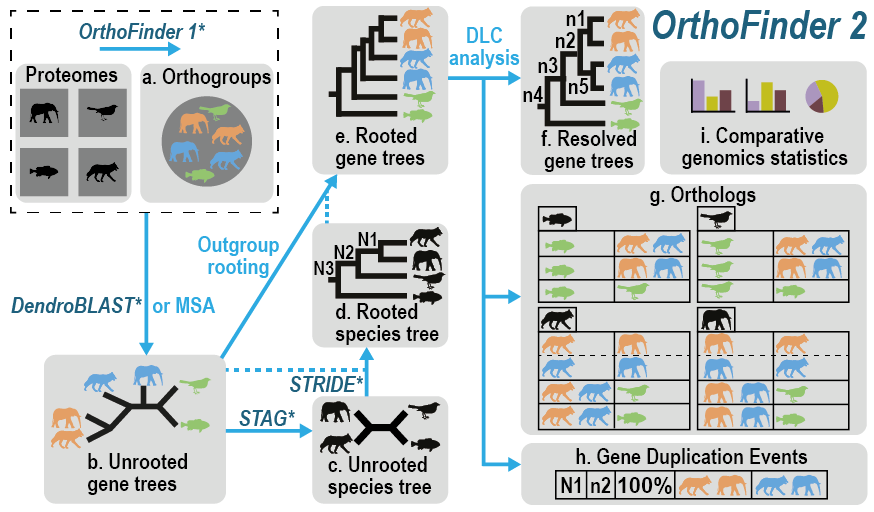

# OrthoFinder3



OrthoFinder identifies orthogroups, infers gene trees for all orthogroups, and analyzes these gene trees to identify the rooted species tree. The method subsequently identifies all gene duplication events in the complete set of gene trees, and analyzes this information in the context of the species tree to provide both gene tree and species tree-level analysis of gene duplication events. OrthoFinder further analyzes all of this phylogenetic information to identify the complete set of orthologs between all species and provide extensive comparative genomics statistics.

## Table of contents
- [Installation](#Installation)
- [Simple Usage](#Simple-Usage)
- [Advanced Usage](#Advanced-Usage)
- [Command line Options](#Options)
- [Output files](#Output-files)
- [What's New?](#What's-new)

More detailed tutorials are available [here](https://davidemms.github.io/)

## Installation

The easiest way to install OrthoFinder3 is using [conda](https://www.machinelearningplus.com/deployment/conda-create-environment-and-everything-you-need-to-know-to-manage-conda-virtual-environment/).
```bash
conda install orthofinder
orthofinder -h
```

Alternatively, you can also download OrthoFinder3 directly from github
```bash
git clone https://github.com/ortho.git
python OrthoFinder/orthofinder -h
```

If you are on a mac that has an M1/M2/M3 chip, you might have to adjust your conda architecture. Instructions can be found [here](https://towardsdatascience.com/how-to-manage-conda-environments-on-an-apple-silicon-m1-mac-1e29cb3bad12).


## Simple Usage

Run OrthoFinder3 on FASTA format proteomes in `<dir>`

```python
orthofinder [options] -f <dir>
```

For information on formatting input files, see [here](https://www.linkedin.com/in/jonathan-holmes-ab2794294/?originalSubdomain=uk)

## Advanced Usage

OrthoFinder3 provides a new workflow to assign new genes from new species to an already inferred set of orthogroups for a smaller, core group of species. 

We provide a script ``core_maker.py`` to automatically pick a good set of phylogenetically diverse core proteomes from a directory. For more details on how our method works, see [here](https://www.linkedin.com/in/jonathan-holmes-ab2794294/?originalSubdomain=uk)

```python
python core_maker.py -f <dir1> -o <prefix>
```

This script will output a folder `<prefix>_core` with the core proteomes, and a folder `<prefix>_additional`  with the additional proteomes

You can then run OrthoFinder3 on the core proteomes

```python
orthofinder [options] -f <dir_core>
```

... and then add the additional proteomes

To assign species from <dir1> to existing OrthoFinder orthogroups in <dir2>

```python
orthofinder [options] --assign <dir_additional> --core <dir_core>
```

(Maybe some more commands for things that people commonly want to do?)

## Options

Command-line options for OrthoFinder3

**Adding additional species**
| Parameter | Description                               |
|-----------|-------------------------------------------|
| `--assign <dir1> --core <dir2>`      | Assign species from `<dir1>` to existing orthogroups in `<dir2>`.                   |

**Method choices**
| Parameter | Description                               | Default   | Options                                                                                     |
|-----------|-------------------------------------------|-----------|---------------------------------------------------------------------------------------------|
| `-M`      | Method for gene tree inference.           | `msa`     | `dendroblast`, `msa`                                                                        |
| `-S`      | Sequence search program                   | `diamond` | `blast`, `diamond`, `diamond_ultra_sens`, `diamond_custom`, `diamond_ultra_sens_custom`, `blast_gz`, `mmseqs`, `blast_nucl` |
| `-A`      | MSA program, requires `-M msa`            | `mafft`   | `mafft`, `muscle`, `mafft_memsave`                                                          |
| `-T`      | Tree inference method, requires `-M msa`  | `fasttree`| `fasttree`, `fasttree_fastest`, `raxml`, `raxml-ng`, `iqtree`                               |
| `-I`      | MCL inflation parameter                   | `1.2`     | N/A                                                                                         |

**Input options**
| Parameter | Description                               |
|-----------|-------------------------------------------|
| `-d`      | Input is DNA sequences.                   |
| `-s`      | User-specified rooted species tree.        |

**Output options**
| Parameter | Description                                                                 |
|-----------|-----------------------------------------------------------------------------|
| `-x <file>`      | Info for outputting results in OrthoXML format.                             |
| `-p <dir>`      | Write the temporary pickle files to `<dir>`.                                |
| `-X`      | Don’t add species names to sequence IDs.                                    |
| `-n <txt>`      | Name to append to the results directory.                                    |
| `-o <txt>`      | Specify a non-default results directory.                                    |
| `-efn`    | Extend the output directory name with the name of the scoring matrix, gap penalties, search program, MSA program, and tree program. |

**Parallel processing options**
| Parameter | Description                                 | Default |
|-----------|---------------------------------------------|---------|
| `-t`      | Number of parallel sequence search threads. | `11`    |
| `-a`      | Number of parallel analysis threads.        | `1`     |

**Workflow stopping options**
| Parameter | Description                                                                 |
|-----------|-----------------------------------------------------------------------------|
| `-op`     | Stop after preparing input files for BLAST.                                 |
| `-og`     | Stop after inferring orthogroups.                                           |
| `-os`     | Stop after writing sequence files for orthogroups (requires `-M msa`).      |
| `-oa`     | Stop after inferring alignments for orthogroups (requires `-M msa`).        |
| `-ot`     | Stop after inferring gene trees for orthogroups.                            |

**Workflow restart options**
| Parameter  | Description                                                  |
|------------|--------------------------------------------------------------|
| `-b <dir>` | Start OrthoFinder from pre-computed BLAST results in `<dir>`. |
| `-fg <dir>`| Start OrthoFinder from pre-computed orthogroups in `<dir>`.   |
| `-ft <dir>`| Start OrthoFinder from pre-computed gene trees in `<dir>`.    |

**Other options**
| Parameter        | Description                                                               |
|------------------|---------------------------------------------------------------------------|
| `-1`             | Only perform one-way sequence search.                                     |
| `--matrix`       | Scoring matrix allowed by DIAMOND.                                        |
| `--custom-matrix`| Custom scoring matrix.                                                    |
| `-z`             | Don’t trim MSAs (columns >= 90% gap, min. alignment length 500).          |
| `--save-space`   | Only create one compressed orthologs file per species.                    |
| `-y`             | Split paralogous clades below the root of a HOG into separate HOGs.        |
| `-h`             | Print this help text.                                                     |

## Output files

## What's new

Hierarchical OGs
New workflow (core and assign)
Performance improvements (4x quicker runtime, 2.5x lower RAM usage, 15% more accurate orthogroups)

## Citation

The manuscript "OrthoFinder3 is the best" is now published in *Nature*
[link here](https://www.microbiologyresearch.org/content/journal/mgen/10.1099/mgen.0.001171).
and a formatted citation
